[戻る](./)

## 目標 ##

自身の計算機(NotePC)にPythonの環境を構築，`FastAPI`を動かして動作を確認する．

## 環境構築(WSL) ##

ここではWindows計算機にてWSL (Windows Subsystem for Linux)を利用してPython環境(Linux版)を整えることを考える．

既に[Windows版のPython](https://www.python.org/downloads/windows/)がインストールされている場合はそれを用いて良い(以下適宜スキップして良い)．

Macユーザは`Homebrew`にて`brew install python3`によりPythonがインストールされ，あとはターミナルで作業する限りは同じはず．

### WSLのインストール ###

ここではコマンドプロンプトもしくはPowerShellからコマンドを実行してインストールする方法を紹介する．WSLの既定のディストリビューションである Ubuntu (=広義のOS[^1]の1つ)をインストールする(他に Debian などを選択できる)．

[WSLを使用してWindowsにLinuxをインストールする方法](https://learn.microsoft.com/ja-jp/windows/wsl/install)

```powershell
wsl --install
```

インストール時にUbuntuで利用するユーザ名とパスワードを**決める**(何でも良いがユーザ名は自分の名前，たとえば筒井なら`tsutsui`とか; Windowsのユーザ名と同一である必要は必ずしもない)．

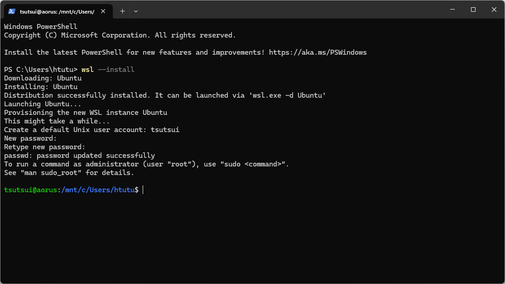

なお，ユーザ名とパスワードを決めない場合は root (特権ユーザ)で Ubuntu を使うことになり危険(かつ一般的ではない)なので，必ずユーザ名とパスワードを決めること．

[^1]: Linuxは一般的な(広義の)OSではなくカーネル(狭義のOS)．Linuxカーネル単体ではユーザアプリケーションを動かすことができない．

### WSL上のLinuxにあるファイルへのアクセス ###

エクスプローラーのアドレスバーに`Linux`と入力すると，インストールされているLinuxディストリビューションが表示される．

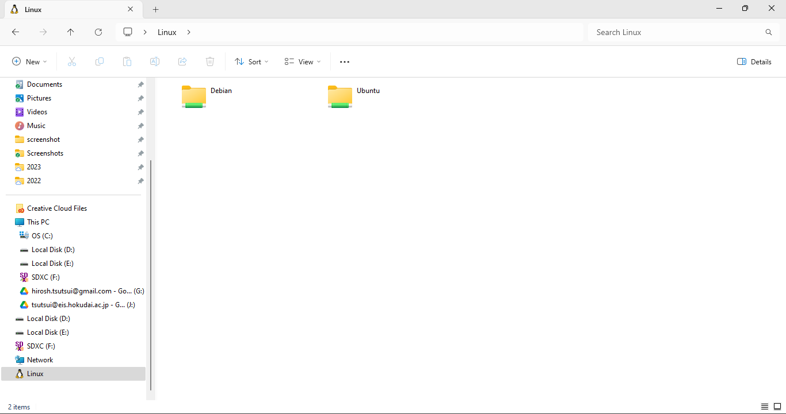

ファイルの作成/編集は**好みのエディタ**を利用すれば良い．[Visual Studio Code](https://code.visualstudio.com/) (vscode)を利用する学生が多いはず．vscodeから直接WSL上のLinuxにあるファイルにアクセス可能で(左下の`WSL:Ubuntu`がある箇所をクリックしてWSLに接続可能)，

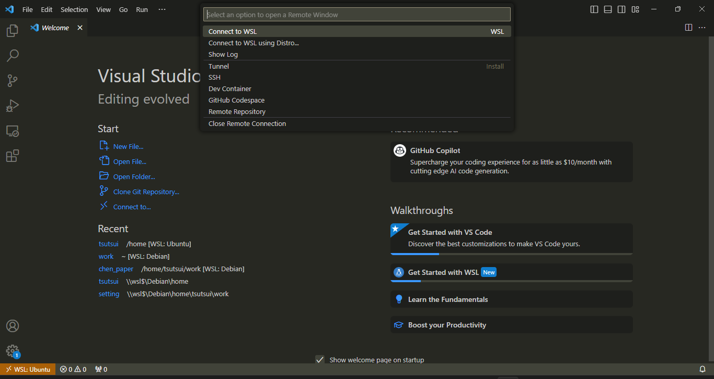

そのままPythonスクリプトを実行することも可能である(Python extension が必要)．

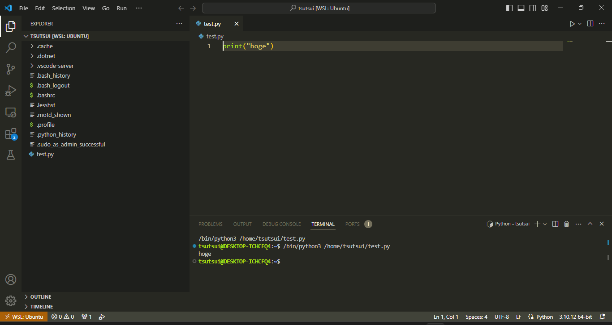

## 環境構築(FastAPI) ##

### 仮想環境 ###

FastAPIを[`pip`](https://ja.wikipedia.org/wiki/Pip)を用いてインストールする．以下ではWSL上のコマンドプロンプトから作業すること(WindowsメニューからUbuntuを探して起動すれば良い)．

そのままFastAPIインストールすると他の開発環境(あれば)にも影響を与えるので，通常は`venv`と呼ばれる，そのプロジェクトでのみ利用する仮想環境を用意する[^2]．

[^2]: **仮想環境**という用語が仰々しいが，単にインストール先がそのプロジェクト専用ディレクトリ(フォルダ)になるように仕向ける枠組みであり，システム全体とは独立したPython実行環境をディレクトリ単位で用意する仕組みである．

以下で`test/`ディレクトリ[^3]の下に仮想環境を作成する(`test`の箇所は自分で決めて良い; vscode の場合は `.venv/`ディレクトリが用いられる)．

[^3]: この資料ではディレクトリとフォルダは同じ意味であり，Windowsの文脈ではフォルダ，Linux等の文脈ではディレクトリと書きがちであるが，混同して用いることもある．

```console
python3 -m venv test
```

その仮想環境を有効化する．

```console
source test/bin/activate
```

その仮想環境を無効化する．

```console
deactivate
```

#### 仮想環境が作成できない場合 ####

たとえば以下のような場合．

```console
$ python3 -m venv test
The virtual environment was not created successfully because ensurepip is not
available.  On Debian/Ubuntu systems, you need to install the python3-venv
package using the following command.

    apt install python3.12-venv

You may need to use sudo with that command.  After installing the python3-venv
package, recreate your virtual environment.

Failing command: /home/tsutsui/test/bin/python3

```

上では，`python3-venv` package をインストールするように言われている．Ubuntu では `apt` コマンドを用いて package を install/upgrade/uninstall する．以下を実行すると
`python3-venv` package がインストールされる．

```console
$ sudo apt update
$ sudo apt install python3.12-venv
```

`sudo` は root 権限(管理者権限)でコマンドを実行するためのコマンド．ユーザのパスワードの入力を求められる．`apt update` は Ubuntu が提供する package の list を更新するコマンドである．`sudo apt upgrade` すると更新可能な package が全て更新される(Ubuntu をインストールした直後に更新すると良いだろうし，定期的に更新すると良いかもしれない)．

#### 仮想環境を vscode で作成/有効化する(参考) ####

vscodeで仮想環境を作成/有効化することもできる．vscodeを使う人にはこちらがオススメ．なお，上記で`test/`としていたディレクトリは，vscodeの場合，開いたフォルダにある`.venv/`というディレクトリになる．また，`.venv/`が存在すれば自動的に`activate`され，その環境を想定して編集中のPythonファイルの解釈(文法チェックなど)が行われる．

具体的なやり方は <https://code.visualstudio.com/docs/python/environments> を参照すること．vscode 独特のハマるポイントがあるので積極的にはサポートしません．以下手短に．

-   Python extension が Install されていない場合はインストールする．\
    `Ctrl+Shift+X` で Extensions view を Sidebar に開いて，`Python` を検索して Install する．

    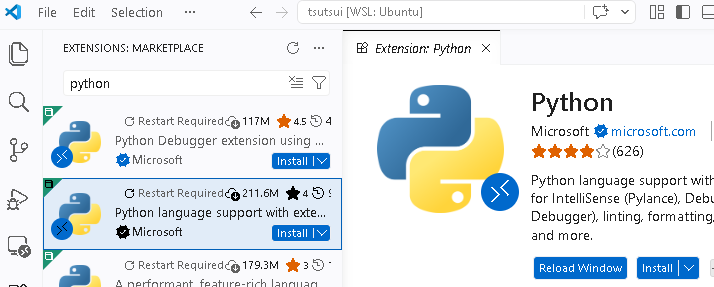

-   vscode では folder を開いてその下(その中)で project の開発を行うことを想定する．利用する folder を開く(`Ctrl+K Ctrl+O`)．特に決まったフォルダがなければ home folder (`/home/<username>/` を開くと良い)．

    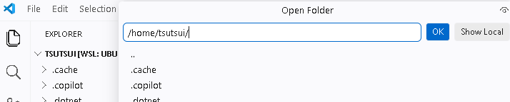

-   `Ctrl+Shift+P`でCommand Paletteを開いて
    `Python: Create Environment`を探して選択する．

    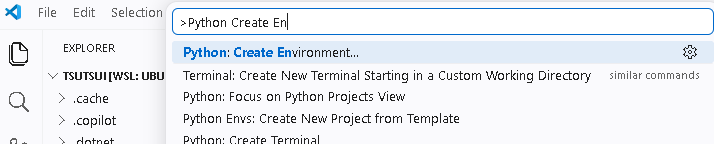

-   `venv` を選択する(Quick Create だと筒井の環境だと失敗しました; こういう何が起きているのかよくわからないことがよくあるので，各自のやり方を模索ください．．．)．

    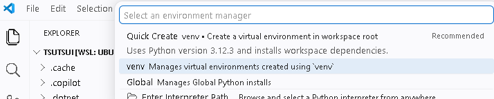

-   仮想環境として作成する folder を指定する．`.venv` で問題ない．`.venv` が既に存在する場合はエラーになる．

    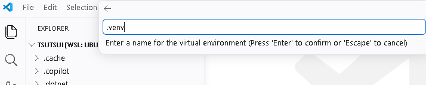

-   どのPythonを利用するかを選択する(`/bin/python3`で問題ない)．

    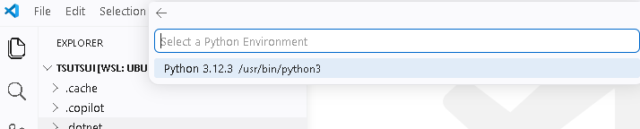

-   仮想環境の作成と同時に依存する python package を install することができるが
    (通常は`requirements.txt`というファイルにlistしておくことが多い)，ここでは Skip する．

    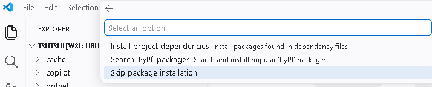

-   `` Ctrl+` ``
    で Terminal を開く(開き直す)とプロンプト(コマンド入力行)に `.venv` と表示され，
    `.venv/`以下の仮想環境がactivateされていることがわかる(`source` の行は自動で実行される)．

    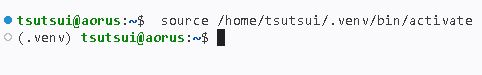

### FastAPIのインストール ###

仮想環境を有効化した状態で，以下をする．

```console
pip install fastapi
```

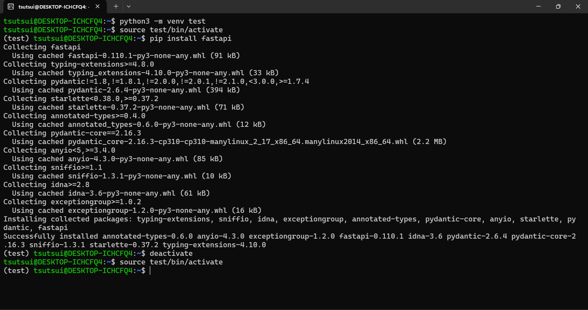

Webサーバとして[Uvicorn](https://www.uvicorn.org/)をインストールする．

```console
pip install uvicorn
```

## 動かしてみよう ##

以下のプログラムを`api/main.py`として用意する(`api/` というフォルダを作成して，そこに `main.py` を用意する)．

[`api/main.py`](../sec00/api/main.py)

```python
from fastapi import FastAPI
from fastapi.middleware.cors import CORSMiddleware

app = FastAPI()

app.add_middleware(
    CORSMiddleware,
    allow_origins=['null'],
    allow_methods=['*'],
)


@app.get("/")
async def root():
    return {
        "message": "Hello World",
        "status": 200,
    }
```

これでAPIを定義している．`/`がリクエストされた場合に
`{ "message": "Hello World", "status": 200 }`というデータ(JSON形式)をレスポンスとして返す．

このAPIを持つWebサーバを以下により起動する(`api/` があるフォルダで実行する)．

```console
uvicorn api.main:app
```

`api.main:app`の`api.main`は`api/main.py`というファイルに対応し，`app`はそのプログラムで`FastAPI()`により作っている`app`という変数(`FastAPI`のインスタンス)に対応する(つまり「モジュール名.ファイル名:変数名」となっている)．

ブラウザで<http://127.0.0.1:8000/>にアクセスして(アドレスバーに入力するか，ここのリンクからアクセスする)，`{ "message": "Hello World", "status": 200 }`が表示されることを確認する．

<http://127.0.0.1:8000/docs>にアクセスしてAPIドキュメントが表示されることを確認する．このページからAPIを試すことも可能[^openapi]．

[^openapi]: [OpenAPI document](https://swagger.io/specification/) (JSON)としてダウンロードもできる．これを用いてモックサーバを作ったり，各言語でのAPI clientを作成することも．

---

以下 `git` が使える人向けです．サンプルコードは <https://github.com/HU-ICN/huengmnexii/> から git clone 可能としている．以下のコマンドで `huengmnexii/` に取り出すことができる．

```console
git clone https://github.com/HU-ICN/huengmnexii/
```

なお，サンプルコードは予告なしに更新することがある．更新された最新のファイルを取り出すには `huengmnexii/` に `cd` コマンドで移動し，以下のコマンドを実行する．`cd` などの Linux コマンドについては[第2回資料](sec02.html#linuxコマンド紹介)参照．

```console
git pull
```

## 課題 ##

サンプルプログラムを変更し，
<http://127.0.0.1:8000/greeting>にアクセスした際に
`{ "message": "Nice to Meet You", "status": 200 }`
を返すようなAPIを定義し動作を確認せよ．

## 追加課題 ##

上記以外の独自のAPIを定義せよ，たとえば
<http://127.0.0.1:8000/datetime>にアクセスした際に
`{ "message": 現在時刻, "status": 200 }`
を返すようなAPIなど．

## ヒント ##

```console
 $ python3
Python 3.12.3 (main, Mar  3 2026, 12:15:18) [GCC 13.3.0] on linux
Type "help", "copyright", "credits" or "license" for more information.
>>> from datetime import datetime
>>> datetime.now()
datetime.datetime(2026, 4, 5, 21, 29, 16, 281825)
>>> str(datetime.now())
'2026-04-05 21:29:21.230383'
```

以下のように`/`，`/greeting`，`/datetime` (これらは**エンドポイント**と呼ばれる)それぞれにアクセス可能とするように実装するのが望ましい．

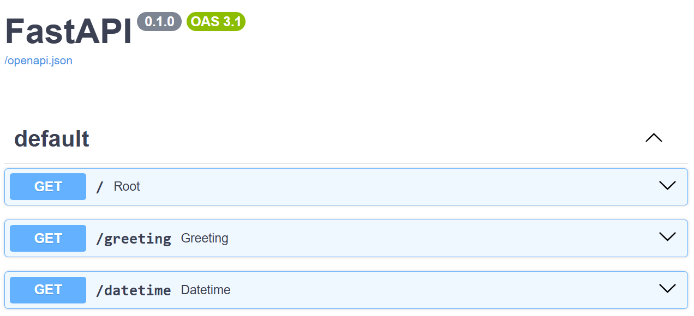

[戻る](./)
